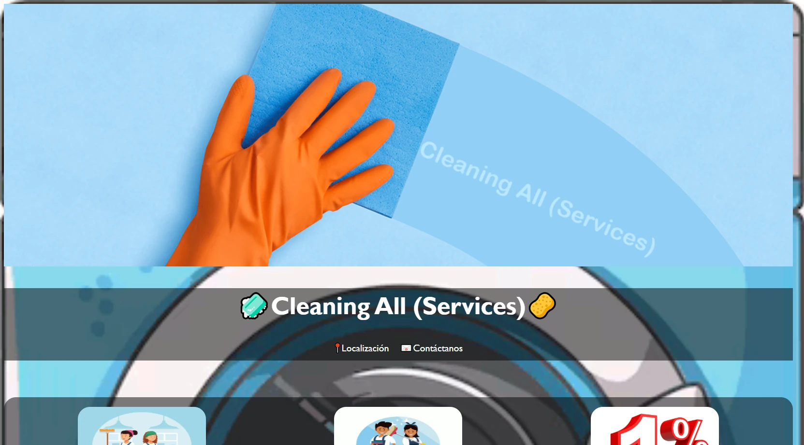
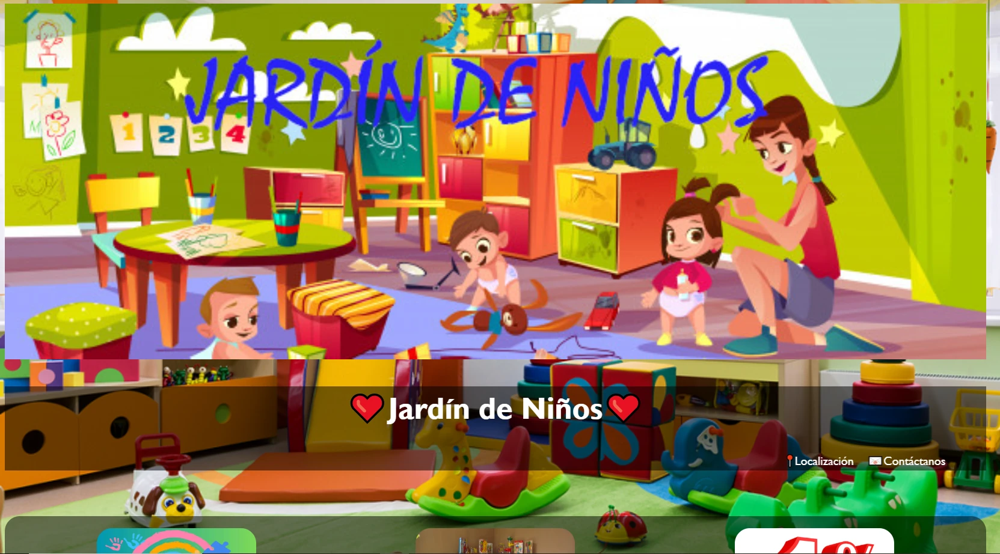
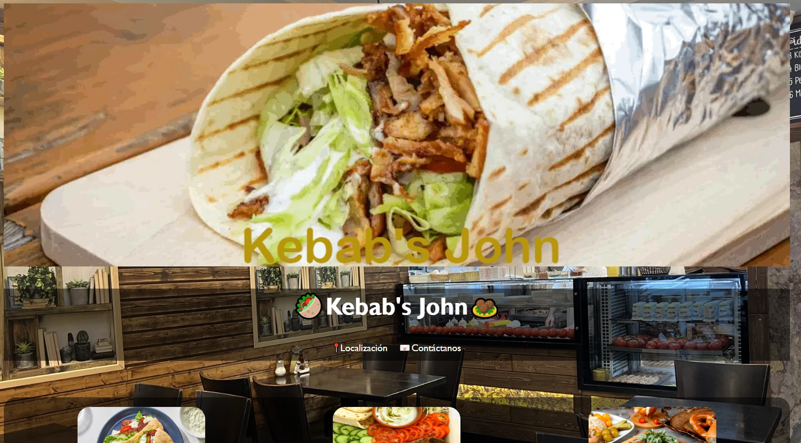
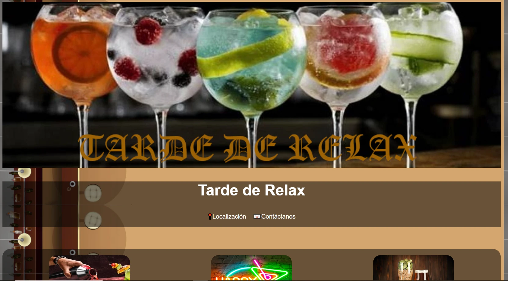
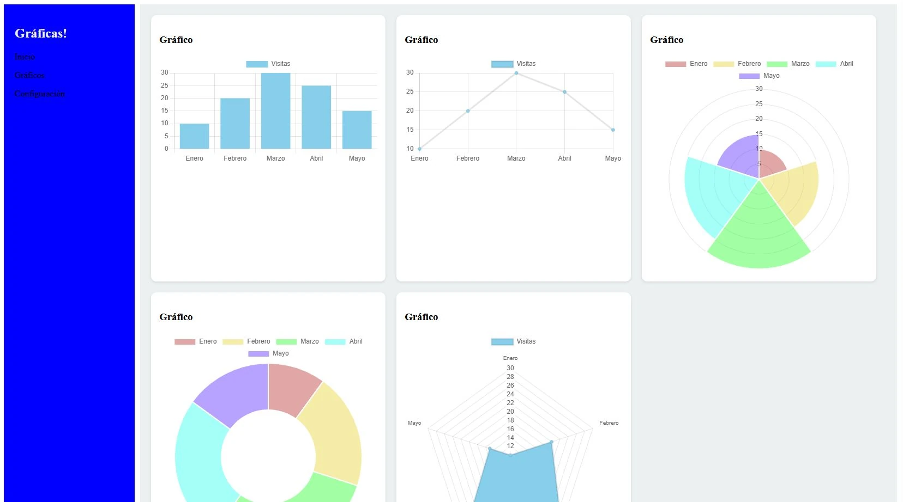
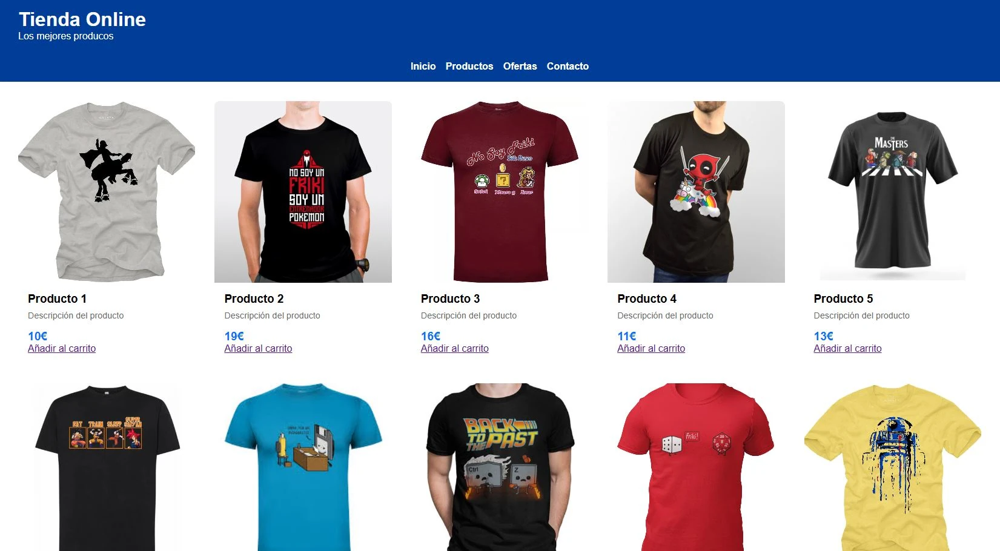

# HTML + CSS

## Proyectos Realizados

### 1. Web Empresa Limpieza

**Descripción:** Proyecto de una web para una empresa de limpieza.  
[🔗 Abrir Proyecto](html/CleaningAll/index.html)

---

### 2. Web Guardería

**Descripción:** Sitio web diseñado para una guardería.  
[🔗 Abrir Proyecto](html/JardindeNinos/index.html)

---

### 3. Web Kebab

**Descripción:** Página para restaurante de kebab.  
[🔗 Abrir Proyecto](html/Kebab/index.html)

---

### 4. Web Bar

**Descripción:** Proyecto web para un bar.  
[🔗 Abrir Proyecto](html/TardesdeRelax/index.html)

---

### 5. Dashboard

**Descripción:** Interfaz de Dashboard moderna.  
[🔗 Abrir Proyecto](html/Dashboard/index.html)

---

### 6. Tienda Online

**Descripción:** Sitio web de tienda en línea.  
[🔗 Abrir Proyecto](html/TiendaOnline/index.html)

---

## Contacto

- 📍 [Localización: Calle, 123, CP](https://www.google.es/maps/place/Ermita+de+la+Virgen+de+Valme)
- 📞 Teléfono: 6xx xxx xxx
- ✉️ Correo: [jorgesanru@gmail.com](mailto:jorgesanru@gmail.com)

---

## Métodos de Pago

- Métodos de pago
- Tarjetas regalo
- Cupones
- Política de devoluciones

---

## Más Información

- [Inicio](index.html)
- [Sobre mí](index.html)
- [Preguntas frecuentes](#)
- [Contacta](contacta.html)

---

## Redes Sociales

---

© Jorge Sánchez - Todos los derechos reservados.
